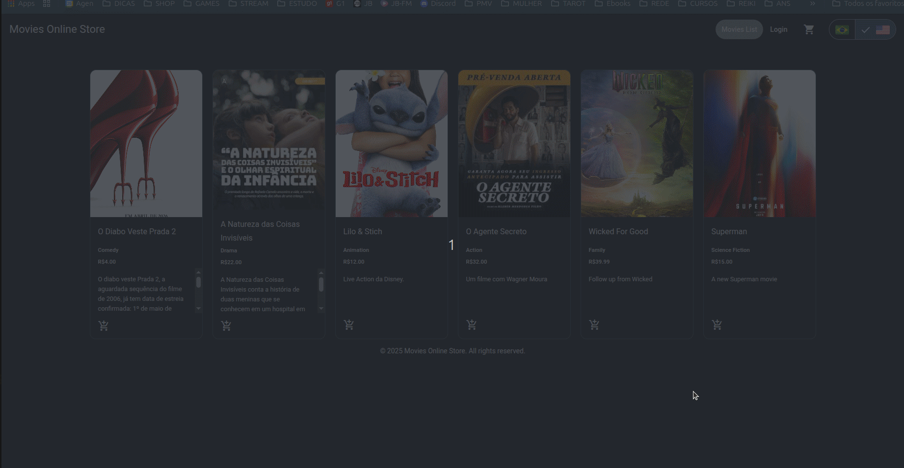

# 🎬 Movie Store (Angular)

Este projeto é uma aplicação de e-commerce para uma loja de filmes, desenvolvida com Angular e Angular Material.  
Conta com autenticação, CRUD de filmes, carrinho de compras e internacionalização completa (PT/EN). 
<p> O projeto foi estruturado para ser modular e escalável, utilizando as melhores práticas do Angular, como o uso de serviços para a lógica de negócios, componentes reutilizáveis e rotas bem definidas com guardas de proteção.
</p>

---

# 🎥 Demonstração da Aplicação




---
## 🚀 Como executar

### 1. Baixe e execute a API (cedida pelo professor **Luis Fernando Bicalho**)
```bash
git clone https://github.com/Kirink212/api-examples.git
cd api-examples/movies-api
npm install
npm start
```
Endpoints principais:

```
GET /movies
GET /movies/:id
POST /movies
PUT /movies/:id
DELETE /movies/:id
POST /login
POST /register
```

---

### 2. Execute o frontend
```bash
git clone https://github.com/RitaJeveaux/movies-store.git
npm install
ng serve
```

Frontend: http://localhost:4200  
Backend: http://localhost:3000

---

### 3. Para Login

- Email: admin@admin.com 
- Senha: admin1234


---
## ✨ Funcionalidades

### 🎬 Catálogo de Filmes
- Cards com título, imagem, preço e ações
- Categoria e plataforma traduzidas dinamicamente

### 🛒 Carrinho de Compras
- Adicionar filmes
- Limpar carrinho

### 🔐 Autenticação
- Login
- Controle de permissões
- Páginas restritas
- Rotas protegidas  

### 🛠 CRUD de Filmes (somente usuários logados) 
- Criar
- Editar
- Remover
- Upload + preview de imagens
- Formulários reativos  

### 🌐 Internacionalização (i18n)
- PT-BR 🇧🇷  
- EN-US 🇺🇸

---

## 🧱 Tecnologias utilizadas

- Angular 20 
- Angular Material  
- RxJS  
- ngx-translate  
- API REST (Node.js / JSON Server)  
- TypeScript  

---

## 🙏 Agradecimentos

Agradeço profundamente:

- a **Cognizant**, pela oportunidade do curso  
- a **ADA**, pela excelência do conteúdo e metodologia  
- Aos queridos professores  
  - **Luis Fernando Bicalho** 
  - **Roosevelt Franklin**

---

Este é o **projeto final do curso de Angular**, desenvolvido com muito carinho, dedicação e café. ☕✨

---
<p style="text-align:center">Novenbro de 2025</p>
